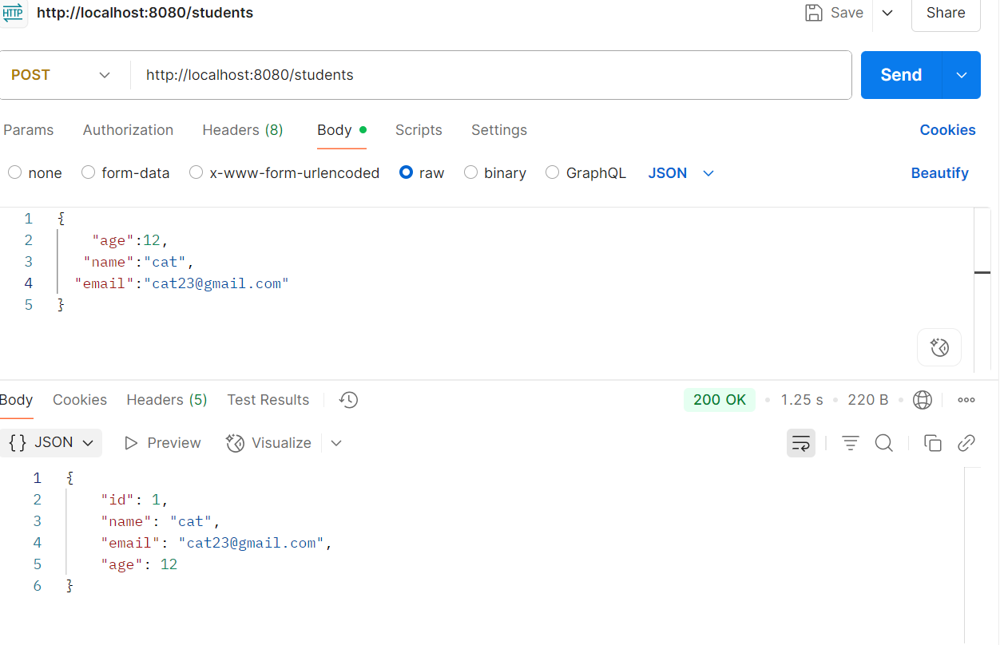
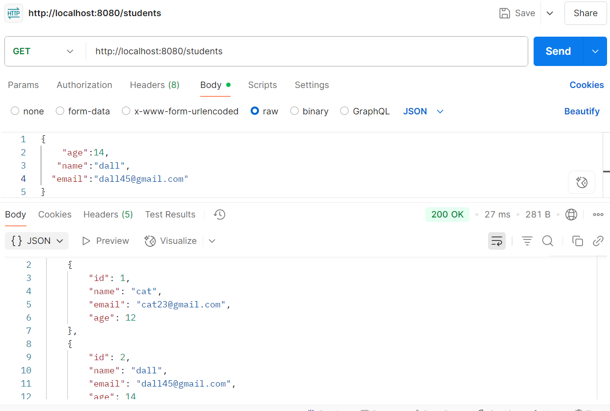
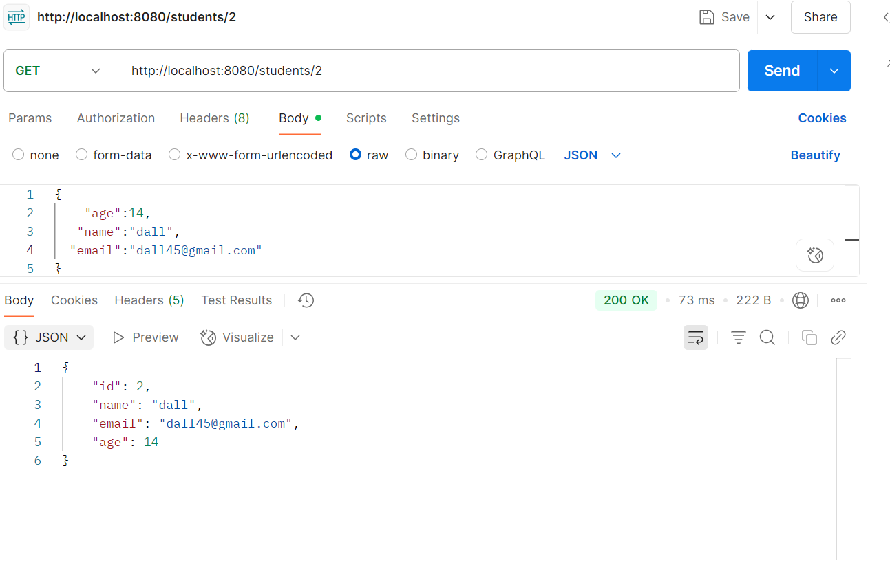
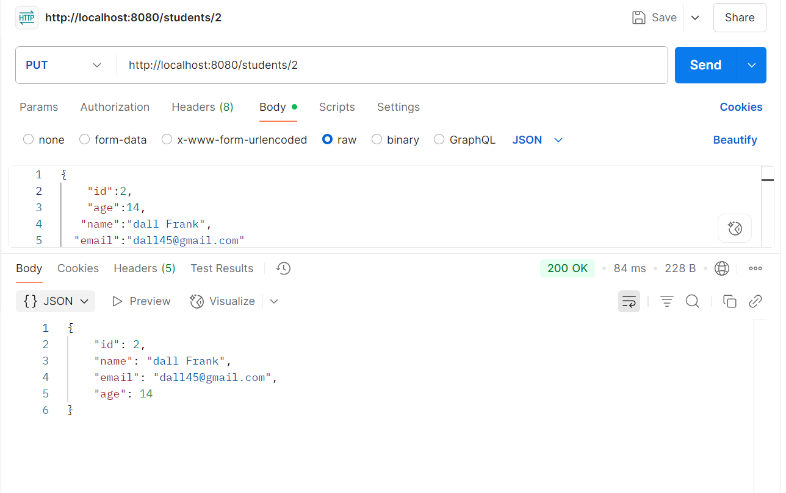
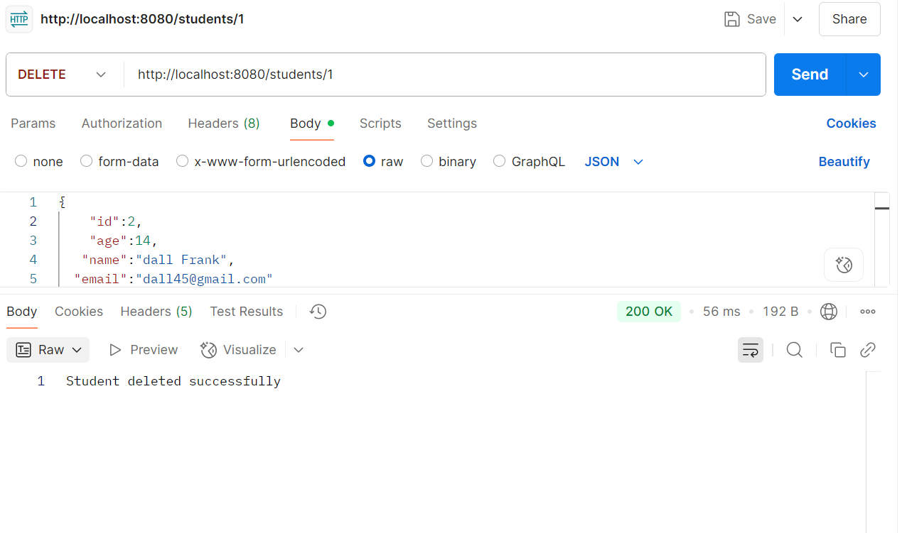

# 🧑‍🎓 Student Management CRUD API

This is a *Spring Boot CRUD application* to manage student records using *Spring Data JPA, **MySQL, and tested with **Postman*. The application supports creating, reading, updating, and deleting student information through RESTful APIs.

---

## 🛠 Technologies Used

- 🌱 Spring Boot
- 💾 Spring Data JPA
- 🐬 MySQL
- 📬 Postman (for API testing)
- ☕ Java
- 🌐 REST API

---

## 📁 Project Structure


---

## ⚙ API Endpoints

| Method | Endpoint               | Description             |
|--------|------------------------|-------------------------|
| POST   | /students            | Create new student      |
| GET    | /students            | Get all students        |
| GET    | /students/{id}       | Get student by ID       |
| PUT    | /students/{id}       | Update student by ID    |
| DELETE | /students/{id}       | Delete student by ID    |

---

## 📸 Sample Output

> Ensure you've uploaded these images inside a folder named /screenshots in your repo.

### ✅ Create Student



### 📋 Get All Students



### 🔍 Get Student By ID



### 🔁 Update Student



### ❌ Delete Student



---

## 📦 How to Run

1. Clone the repository:
   ```bash
   git clone https://github.com/hasmashaik/Student_CRUD_JPA.git

2.Set up MySQL Database:

Create a database named student_db

Update application.properties with your DB credentials:

spring.datasource.url=jdbc:mysql://localhost:3306/student_db
spring.datasource.username=root
spring.datasource.password=yourpassword
spring.jpa.hibernate.ddl-auto=update

3.Run the project:

Open the project in Eclipse or any IDE

Run StudentCrudApplication.java as a Spring Boot application
